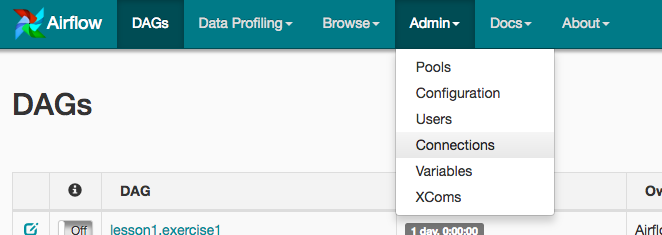
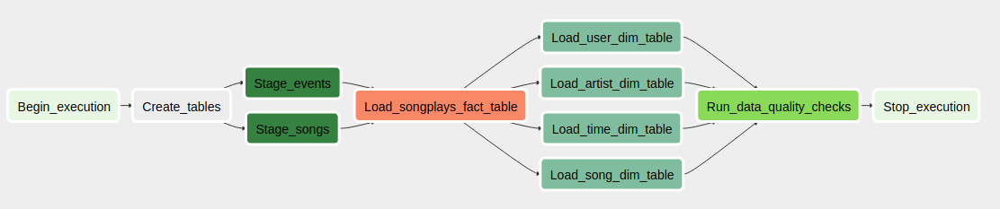

## Summary

A music streaming company, Sparkify, has decided that it is time to introduce more automation and monitoring to their data warehouse ETL pipelines and come to the conclusion that the best tool to achieve this is Apache Airflow.

The project expects to create high-grade data pipelines that are dynamic and built from reusable tasks, can be monitored, and allow easy backfills. The data quality plays a big part when analyses are executed on the data warehouse and run tests against their datasets after the ETL steps have been executed to catch any discrepancies in the datasets.

The source data resides in S3 and needs to be processed in Sparkify's data warehouse in Amazon Redshift. The source datasets consist of JSON logs that tell about user activity in the application and JSON metadata about the songs the users listen to.

## How Config Airflow

### Add Airflow Connections
The Airflow's UI is used to configure AWS credentials and connection to Redshift.

1. Open http://localhost:8080 in Google Chrome (other browsers occasionally have issues rendering the Airflow UI).
2. Click on the Admin tab and select Connections.

3. Under Connections, select Create.

4. On the create connection page, enter the following values:
* Conn Id: Enter aws_credentials
* Conn Type: Enter Amazon Web Services
* Login: Enter with Access key ID from the IAM User credentials downloaded
* Password: Enter your Secret access key from the IAM User credentials downloaded

### Connection

5. On the next create connection page, enter the following values:
* Conn Id: Enter 'redshift'.
* Conn Type: Enter 'Postgres'.
* Host: Enter the endpoint of your Redshift cluster, excluding the port at the end. You can find this by selecting your cluster in the Clusters page of the Amazon Redshift console. 
IMPORTANT: Make sure to NOT include the port at the end of the Redshift endpoint string.
* Schema: This is the Redshift database you want to connect to
* Login: Enter database name
* Password: Enter the password you created when launching your Redshift cluster
* Port: Enter 5439

### Datasets 

* Log data: s3://udacity-dend/log_data
* Song data: s3://udacity-dend/song_data

### Operators

There are four different operators that stage and transform the data, and run checks on data quality. All of the operators and task instances will run SQL statements against the Redshift database. However, using parameters wisely will allow you to build flexible, reusable, and configurable operators you can later apply to many kinds of data pipelines with Redshift and with other databases.

#### Stage Operator

The stage operator is expected to be able to load any JSON formatted files from S3 to Amazon Redshift. The operator creates and runs a SQL COPY statement based on the parameters provided.

#### Fact and Dimension Operators

With dimension and fact operators will be possible to run data transformations.  Most of the logic is within the SQL transformations and the operator is expected to take as input a SQL statement and target database on which to run the query against

#### Data Quality Operator

The final operator to create is the data quality operator, which is used to run checks on the data itself. The operator's main functionality is to receive one or more SQL based test cases along with the expected results and execute the tests. For each the test, the test result and expected result needs to be checked and if there is no match, the operator should raise an exception and the task should retry and fail eventually.

### Task Dependencies 

 
